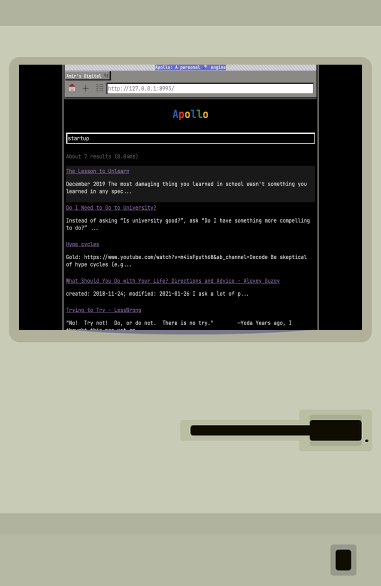
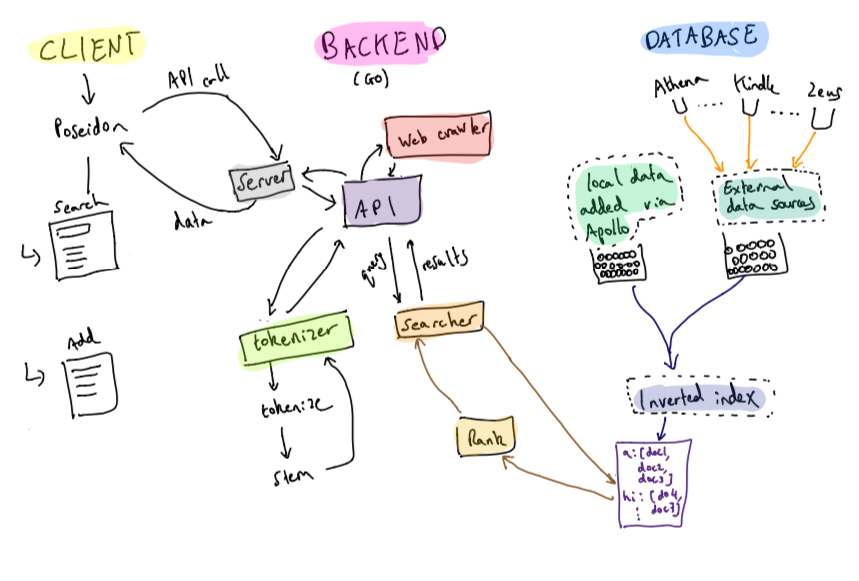

# Apollo 💎
### A Unix-style personal search engine and web crawler for your digital footprint
<div style="text-align:center">
    
</div>

## Demo

https://user-images.githubusercontent.com/7995105/126933240-b8176047-7cc4-4b22-91dc-aee7490476ed.mp4


## Contents
[Background](#background)  
[Thesis](#thesis)  
[Design](#design)
[Architecture](#architecture)  
[Data Schema](#data-schema)  
[Workflows](#workflows)  
[Document Storage](#document-storage)  
[Shut up, how can I use it?](#shut-up-how-can-i-use-it)  
[Notes](#notes)  
[Future](#future)  
[Inspirations](#inspirations)  


## Background
Apollo is a different type of search engine. Traditional search engines (like Google) are great for **discovery** when you're trying to find the answer to a question, but you don't know what you're looking for.

However, they're very poor at **recall and synthesis** when you've seen something before on the internet somewhere but can't remember where. Trying to find it becomes a nightmare - how can you synthezize the great material on the internet when you forgot where it even was? I've wasted many an hour combing through Google and my search history to look up a good article, blog post, or just something I've seen before.

Even with built in systems to store some of my favorite [articles](https://zeus.amirbolous.com/articles), [podcasts](https://zeus.amirbolous.com/podcasts), and other stuff, I forget things **all the time**.

## Thesis
Screw finding a needle in the haystack. Let's create a new type of search to **choose which gem you're looking for**

Apollo is a search engine and web crawler to digest **your digital footprint**. What this means is that **you choose what to put in it**. When you come across something that looks interesting, be it an article, blog post, website, whatever, you **manually add it** (with built in systems to make doing so easy). If you always want to pull in data from a certain data source, like your notes or something else, you can do that too. This tackles one of the biggest problems of recall in search engines returning a lot of irrelevant information because with Apollo, **the signal to noise ratio is very high**. You've chosen **exactly what to put in it**.

Apollo is not necessarly built for raw discovery (although it certainly matches rediscovery), it's built for knowledge compression and transformation - that is looking up things that you've previously deemed to be cool

## Design
The first thing you might notice is that the design is reminiscent of the old digital computer age, back in the Unix days. This is intentional for many reasons. In addition to paying homage to the greats of the past, this design makes me feel like I'm searching through something that is authentically my own. When I search for stuff, I genuinely feel like I'm **travelling through the past**.

## Architecture

Apollo's client side is written in [Poseidon](https://github.com/amirgamil/poseidon). The client side interacts with the backend via a REST-like API which provides endpoints for searching data and adding a new entry.

The backend is written in Go and is composed of a couple of important components
1. The web server which serves the endpoints
2. A tokenizer and stemmer used during search queries and when building the inverted index on the data
3. A simple web crawler for scraping links to articles/blog posts/YouTube video
4. The actual search engine which takes a query, tokenizes and stems it, finds the relevant results from the inverted index using those stemmed tokens
then ranks results with [TF-IDF](https://monkeylearn.com/blog/what-is-tf-idf/#:~:text=TF%2DIDF%20is%20a%20statistical,across%20a%20set%20of%20documents.)
5. A package which pulls in data from a couple of different sources - if you want to pull data from a custom data source, this is where you should add it.

## Data Schema
Two schemas we use, one to first parse the data into some encoded format. 
This does not get stored, it's purely an intermediate before we transform it into a record for our inverted index.
Why is this important?
- Because since any data gets parsed into this standarized format, you can link **any data source** you want, if you build your own tool, if you store a lot of data in some existing one, you don't have to manually add everything. You can pull in data from any data source provided you give the API data in this format.
```go
type Data struct {
    title string //a title of the record, self-explanatory
    link string //links to the source of a record, e.g. a blog post, website, podcast etc.
    content string //actual content of the record, must be text data
    tags []string //list of potential high-level document tags you want to add that will be
                  //indexed in addition to the raw data contained 
}
```

```go
//smallest unit of data that we store in the database
//this will store each "item" in our search engine with all of the necessary information
//for the inverted index
type Record struct {
	//unique identifier
	ID string `json:"id"`
	//title
	Title string `json:"title"`
	//potential link to the source if applicable
	Link string `json:"link"`
	//text content to display on results page
	Content string `json:"content"`
	//map of tokens to their frequency
	TokenFrequency map[string]int `json:"tokenFrequency"`
}
```


## Workflows

Data comes in many forms and the more varied those forms are, the harder it's to write reliable software to deal with it. If everything I wanted to index was just stuff I wrote, life would be easy. All of my notes would probably live in one place, so I would just have to grab the data from that data source and chill

The problem is I don't take a lot of notes and not everything I want to index is something I'd take notes of.

So what to do? 

Apollo can't handle all types of data, it's not designed to. However in building a search engine to index stuff, there are a couple of things I focused on:

1. Any data that comes from a specific platform can be integrated. If you want to index all your Twitter data for example,
this is possible since all of the data can be absorbed in a constant format, converted into the compatible apollo format, and sent off.
So data sources can be easily integrated, this is by design in case I want to pull in data from personal tools.
2. The harder thing is what about just, what I wil call, "writing on the internet." I read a lot of stuff on the Internet, much of which I'd like to be able to index, without necessarily having to takes notes on everything I read because I'm lazy. The dream would be to just be able to drop a link and have Apollo intelligently try to fetch the content, then I can index it without having to go to the post and copying the content, which would be painful and too slow.
This was a large motivation for the web crawler component of the project
- If it's writing on the Internet, should be able to post link and autofill pwd
- If it's a podcast episode or any YouTube video, download text transcription e.g. [this](https://github.com/moizahmedd/youtube-video-search)
- If you want to pull data from a custom data source, add it as a file in the `pkg/apollo/sources` folder, following the same rules as some of the examples and make sure to add it in the `GetData()` method of the `source.go` file in this package

## Document storage
Local records and data from data sources are stored in separate JSON files. This is for convenience.

I also personally store my Kindle highlights as a JSON file - I use [read.amazon.com](https://read.amazon.com/) and a readwise [extension](https://readwise.io/bookcision) to download the exported highlights for a book. I put any new book JSON files in a kindle folder in the outer directory and every time the inverted index is recomputed, the kindle file takes any new book highlights, integrate them into the main `kindle.json` file stored in the `data` folder, then delete the old file.

## Shut up, how can I use it?
Although I built Apollo first and foremost for myself, I also wanted other people to be able to use if they found it valuable. To use Apollo locally
1. Clone the repo: `git clone ....`
2. Make sure you have `Go` installed and `youtube-dl` which is how we download the subtitles of a video. You can use [this](https://ostechnix.com/youtube-dl-tutorial-with-examples-for-beginners/) to install it.
3. Navigate to the root directory of the project: `cd apollo` . 
Note since Apollo syncs from some personal data sources, you'll want to remove them, add your own, or build stuff on top of them. Otherwise the terminal wil complain if you attempt to run it, so:
4. Navigate to the `pkg/apollo/sources` in your preferred editor and replace the body of the `GetData` function with `return make(map[string]schema.Data)` 
5. Create a folder `data` in the outer directory
6. Create a `.env` file in the outermost directory (i.e. in the same directory as the `README.md`) and add `PASSWORD=<val>` where `<val>` is whatever password you want. This is necessary for adding or scraping the data, you'll want to "prove you're Amir" i.e. authenticate yourself and then you won't need to do this in the future. If this is not making sense, try adding some data on `apollo.amirbolous.com/add` and see what happens. 
7. Go back to the outer directory (meanging you should see the files the way GitHub is displaying them right now) and run `go run cmd/apollo.go` in the terminal.
8. Navigate to `127.0.0.1:8993` on your browser
9. It should be working! You can add data and index data from the database
If you run into problems, open an issue or DM me on [Twitter](https://twitter.com/amirbolous)
### A little more information on the `Add Data` section
- In order to add data, you'll first need to authenticate yourself - enter your password once in the "Please prove you'r Amir" and if you see a `Hooray!` popup then that means you were authenticated successfully. You only need to do this once since we use `localStorage` to save whether you've been authenticated once or not.
- In order to `scrape` a website, you'll want to paste a link in the link textbox, then click on the button `scrape`. Note this **does not add the website/content** - you still need to click the `add` button if you want to save it. The web crawler works reliably *most of the time* if you're dealing with written content on a web page or a YouTube video. We use a Go ported version of [readability](https://github.com/mozilla/readability) to scrape the main contents from a page if it's written content and [youtube-dl](https://ytdl-org.github.io/youtube-dl/index.html) to get the transcript of a video. In the future, I'd like to make this web crawler more robust, but it works well enough most of the time for now.

As a side note, although I want others to be able to use Apollo, this is not a "commercial product" so feel free to open a feature request if you'd like one but it's unlikely I will get to it unless it becomes something I personally want to use.

## Notes 
- The inverted index is re-generated once every n number of days (currently for n = 3)
- Since this is not a commercial product, I will not be running your *version of this* (if you find it useful) on my server. However, although I designed this, first and foremost for myself, I want other people to be able to use if this is something that's useful, refer to [How can I use this](#shut-up-how-can-i-use-it)
- I had the choice between using Go's `gob` package for the database/inverted index and `JSON`. The `gob` package is definitely faster however it's only native in Go so I decided to go with `JSON` to make the data available in the future for potentially any non-Go integrations and be able to switch the infrastructure completely if I want to etc. 
- I use a ported version of the Go snowball algorithm for my stemmer. Although I would have like to build my own stemmer, implementing a robust one (which is what I wanted) was not the focus of the project. Since the algorithm for a stemmer does not need to be maintined like other types of software, I decided to use one out of the box. If I write my own in the future, I'll swap it out.

## Future
- Improve the search algorithm, more like Elasticsearch when data grows a lot?
- Improve the web crawler - make more robust like [mercury parser](https://github.com/postlight/mercury-parser), maybe write my own
- Speed up search


## Inspirations
- [Monocle](https://github.com/thesephist/monocle) for the idea
- [Serenity OS](https://github.com/SerenityOS/serenity) for the design 
